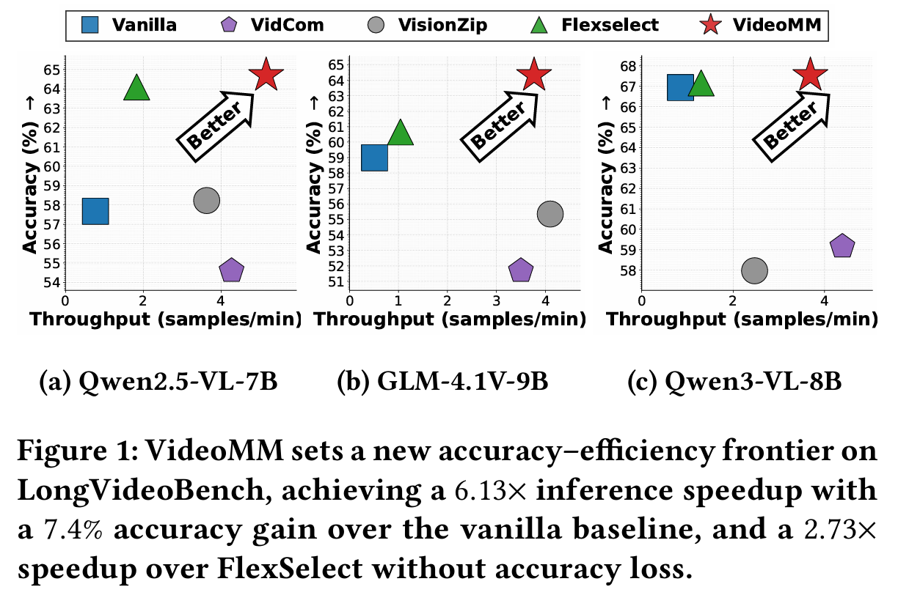
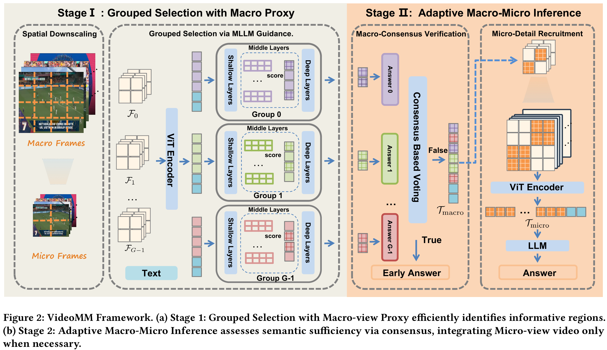

# VideoMM: Adaptive Macro-Micro Inference for Efficient Video MLLMs
This repository contains the official implementation of VideoMM.

## Introduction

Scaling Multimodal Large Language Models (MLLMs) to long-form video understanding is bottlenecked by the explosion of visual tokens, which saturates context windows and incurs prohibitive costs. Existing token reduction methods face an accuracy-efficiency dilemma. 

To resolve this, we propose **VideoMM**, an adaptive macro-micro paradigm mimicking human coarse-to-fine perception:
1. **Grouped Selection with Macro Proxy:** Decouples token selection from dense processing via a lightweight, spatially downscaled proxy.
2. **Adaptive Macro-Micro Inference:** Dynamically recruits high-fidelity micro tokens only when necessary for ambiguous cases using a consensus-based verification mechanism.

**Key Achievements:**
* **6.13x** inference speedup and **7.4%** accuracy gain over full-context baselines on LongVideoBench.
* **2.73x** speedup over the state-of-the-art token reduction method (FlexSelect) without accuracy loss.
* Seamlessly integrates with dynamic-resolution models like **Qwen2.5-VL**, **GLM-4.1V**, and **Qwen3-VL**.

<!-- > 
>  -->
>
<p align="center">
  
  
</p>


## Benchmark Data Preparation

All used benchmarks can be downloaded from huggingface website: [`LongVideoBench`](https://huggingface.co/datasets/longvideobench/LongVideoBench), [`VideoMME`](https://huggingface.co/datasets/lmms-lab/Video-MME), and [`LVBench`](https://huggingface.co/datasets/THUDM/LVBench).

#### Prepare Data For VideoMME (similar to LongVideoBench and LVBench)

1. Download the videos.
2. Unzip the videos
3. Move the data to eval directory 
```bash 
ln -s lmms-lab/Video-MME/videos ./eval/data/videomme/data
ln -s lmms-lab/Video-MME/videomme/test-00000-of-00001.parquet ./eval/data/videomme/test-00000-of-00001.parquet 
```


## Evaluation

We provide ready-to-use evaluation scripts in the `eval/scripts/` directory. Before running, please ensure you have replaced the placeholder paths (e.g., model checkpoints, data directories) inside the `.sh` files with your local paths.


```bash
sh setup.sh
cd ./eval/scripts/
```

**Evaluate Qwen3-VL-8B with VideoMM:**
```bash
bash eval_qwen3_mm.sh
```

**Evaluate Qwen2.5-VL-7B with VideoMM:**
```bash
bash eval_qwen2_5_mm.sh
```

**Evaluate GLM-4.1V-9B with VideoMM:**
```bash
bash eval_glm4v_mm.sh
```


## Analysis Experiments
To explore different accuracy-efficiency trade-offs, we provide scripts for our variants (e.g., extreme downscaling $k=3$):
```bash
# Influence of Downscale factor k (Downscale factor k=3)
bash eval/scripts/eval_qwen3_mm_k3.sh

# AcceleratingTokenCompressionUsing Lightweight MLLMs
bash eval/scripts/eval_qwen3_mm_lite.sh
```


## Acknowledgments
This project is built upon [Flexselect](https://github.com/yunzhuzhang0918/flexselect) and [LMMs-Eval](https://github.com/EvolvingLMMs-Lab/lmms-eval). We thank the original authors for their excellent work on the flexible framework that made this research possible.
